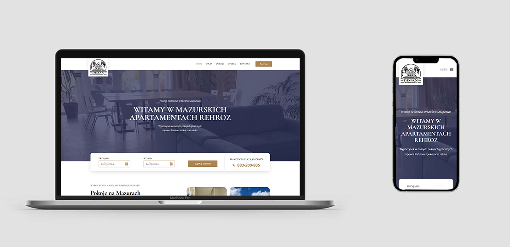
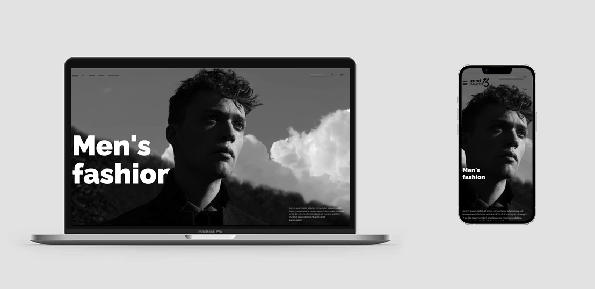
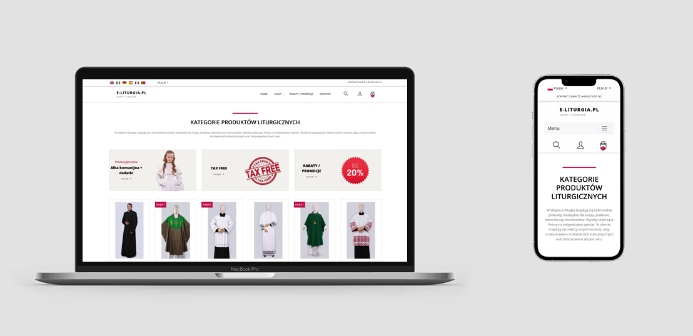
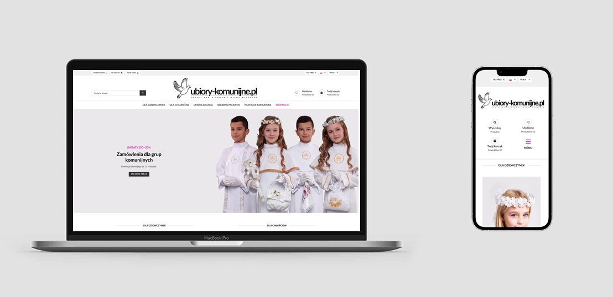
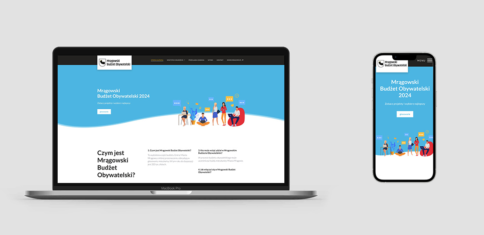
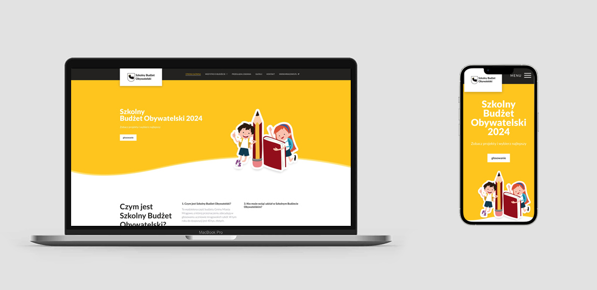
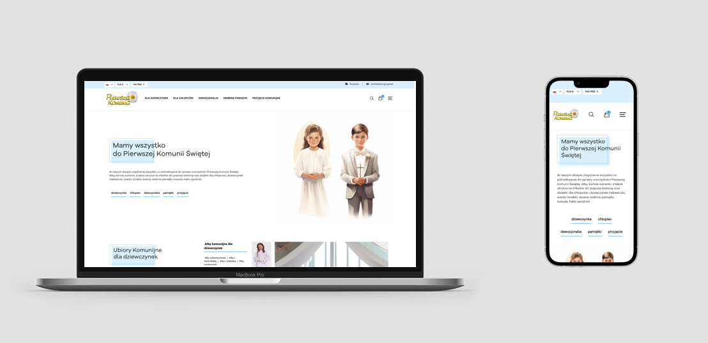
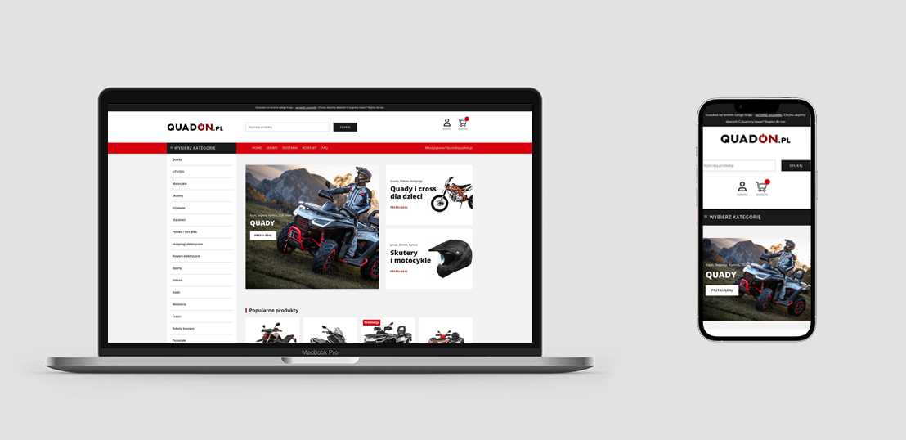
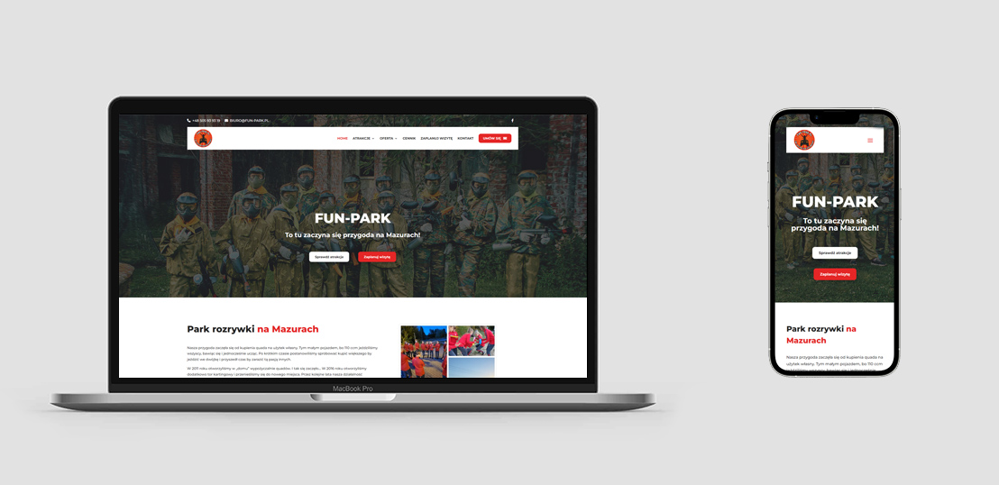

# Hi, I'm Maciek! 👋

Bringing over 10 years of commercial experience, I am deeply passionate about both front-end and back-end development, continuously enhancing technical expertise and soft skills. Thriving on challenges, I find satisfaction in assisting others and engaging in innovative projects. My primary goal is to consistently deliver high-quality work, efficiently managing time. While proficient in PHP, I am currently expanding my expertise in JavaScript, TypeScript, and frameworks like Next.js.

#### Below you will find some of my web application projects - e-commerces and websites

***

## My Projects List

## High-Performance Website for Apartment Rentals 

#### Description:
I developed a fast and engaging website for a client offering apartment rentals, achieving excellent performance and high scores in Core Web Vitals, significantly enhancing user experience. Utilizing a modern tech stack, the site offers smooth animations with Framer Motion, an intuitive interface with TailwindCSS, and efficient data handling through GraphQL. WordPress serves as a headless CMS, enabling easy content management on a dedicated VPS server for unmatched reliability and speed.

#### Tech Stack:
- Next.js 14
- TypeScript
- Framer Motion for animations
- TailwindCSS for responsive design
- GraphQL for efficient data fetching
- WordPress as Headless CMS for content management
- Dedicated VPS server for superior performance and reliability

#### Design:
In designing this website, I focused on creating a seamless user journey that encourages engagement and conversions. By solving key performance challenges, optimizing for SEO, and ensuring web accessibility standards, the website not only stands out in terms of speed and usability but also ranks well on search engines.

#### Results:
The website has received positive feedback for its performance, user-friendly design, and fast loading times, contributing to an increase in client inquiries and longer user sessions.

#### LIVE: [https://mazurskiepokoje.pl/](https://mazurskiepokoje.pl/)

***

## Advanced E-commerce Platform in Next.js 

#### Description:
This project is a state-of-the-art e-commerce platform designed to provide a seamless shopping experience. Utilizing Next.js 14 with TypeScript, the site integrates Stripe for secure and versatile payment options, including WebHooks for real-time notifications. A custom GraphQL server was developed specifically for this project to ensure efficient and scalable data management, working in harmony with a PostgreSQL database hosted on Supabase.com. The incorporation of Prisma ORM streamlines database operations, facilitating robust and maintainable code. Deployed on Vercel, the website benefits from optimal performance and reliability.

#### Tech Stack:
- **Next.js 14:** For a powerful and flexible React framework that enhances SEO and performance.
- **TypeScript:** Ensuring type safety and improving the development process.
- **TailwindCSS:** For a highly customizable, low-level CSS framework that accelerates development speed without sacrificing design flexibility.
- **Prisma ORM:** Simplifies database operations, making the code more robust and easier to maintain.
- **PostgreSQL:** Chosen for its advanced features and reliability, hosted on Supabase.com for enhanced scalability.
- **GraphQL:** Enables efficient and precise data fetching, tailored specifically for this e-commerce project's needs.
- **Stripe:** Integrates secure and versatile payment processing, enhancing the checkout experience.
- **Vercel:** Ensures the site is always fast and reliable, leveraging global distribution.

#### Features:
- **Secure Payment Integration:** Stripe’s comprehensive payment system offers customers a wide range of payment options, increasing conversion rates.
- **Customized Shopping Experience:** Leveraging advanced web technologies to provide a personalized and engaging user journey.
- **Optimized for Performance and SEO:** The project is designed to load quickly and rank well in search engines, thanks to Next.js and efficient data fetching with GraphQL.
- **Scalable Architecture:** Built with future expansion in mind, easily accommodating more products or services.

#### DESIGN: My project

#### LIVE: [https://www.next13majster.pl/](https://www.next13majster.pl/)

***

## Liturgical Stores - Multilingual E-commerce       

Dive into the world of Liturgical Stores, my pride and joy as a developer. This project showcases my ability to create e-commerce platforms that speak in 7 different languages, hosted on servers spread across 4 countries. The technology behind it, including PrestaShop, PHP (Symfony), MySQL, JavaScript, SCSS CSS, and AWS Lightsail, forms a seamless backbone for a globally connected digital shopping experience. The integrations with dedicated systems and external services (stripe, paypal, inpost, GLS) highlight my skills in web development.

#### TECH STACK:
- PrestaShop
- PHP (Symfony)
- MySQL
- JavaScript
- SCSS CSS
- AWS Lightsail
- Adobe XD

#### DESIGN: My project

#### LIVE: [https://www.liturgical-clothing.com/](https://www.liturgical-clothing.com/)

***

## Liturgical Stores - Multilingual E-commerce  

#### TECH STACK:
- PrestaShop
- PHP (Symfony)
- MySQL
- JavaScript
- SCSS CSS
- AWS Lightsail
- Adobe XD

#### DESIGN: My project

#### LIVE: [https://www.ubiory-komunijne.pl/](https://www.ubiory-komunijne.pl/)

***

## Citizen Budget - Dedicated Voting system 

I created this system that enables residents to submit and vote on municipal projects. Vote verification is done through an SMS code, ensuring the security and authenticity of the votes. Local authorities utilize the system for project management.

#### TECH STACK:
- PHP (Symfony)
- MySQL
- JavaScript
- SCSS CSS
- SMS API
- Adobe XD

#### DESIGN: My project

#### LIVE: [https://mragowo.budzetobywatelski.com/](https://mragowo.budzetobywatelski.com/)

***

## School Budget - Dedicated Student Voting System 

Introducing the School Budget, a sibling project to the Citizen Budget voting system, tailored specifically for schools. The voting process is facilitated by one-time codes generated within the system and distributed to students. Successfully implemented in local schools for several years, this system empowers students to actively participate in decision-making processes.

#### TECH STACK:
- PHP (Symfony)
- MySQL
- JavaScript
- SCSS CSS
- Adobe XD

#### DESIGN: My project

#### LIVE: [https://szkolny.budzetobywatelski.com/](https://szkolny.budzetobywatelski.com/)

***

## First Communion - E-commerce  

I invite you to explore the world of the Store with articles for the First Holy Communion, one of my many inspiring projects as a programmer. This project is an excellent reflection of my skills in creating e-commerce platforms. The store, dedicated to purchases related to the First Holy Communion, was created using advanced technologies such as PrestaShop, PHP (Symfony), MySQL, JavaScript, SCSS CSS, utilizing a VPS based on CentOS and the Plesk administrative panel.

Integrations with dedicated systems and external services (Stripe, PayPal, InPost, GLS) emphasize my skills in web development and the ability to tailor the platform to specific customer requirements. With this project, I not only showcase my experience in the e-commerce field but also demonstrate a commitment to delivering personalized solutions, especially in the context of preparations for the special event of the First Holy Communion.

#### TECH STACK:
- PrestaShop
- PHP (Symfony)
- MySQL
- JavaScript
- SCSS CSS
- VPS + CentOS + Plesk
- Adobe XD

#### DESIGN: My project

#### LIVE: [https://pierwszakomunia.pl/](https://pierwszakomunia.pl/)

***

## QuadON.pl - E-commerce  

#### TECH STACK:
- Wordpress
- WooCommerce
- JavaScript
- SCSS CSS
- Adobe XD

#### DESIGN: My project

#### LIVE: [https://quadon.pl/](https://quadon.pl/)

***

## fun-park.pl - Website  

#### TECH STACK:
- Wordpress
- JavaScript
- SCSS CSS
- Adobe XD

#### DESIGN: My project

#### LIVE: [https://fun-park.pl/](https://fun-park.pl/)

***

